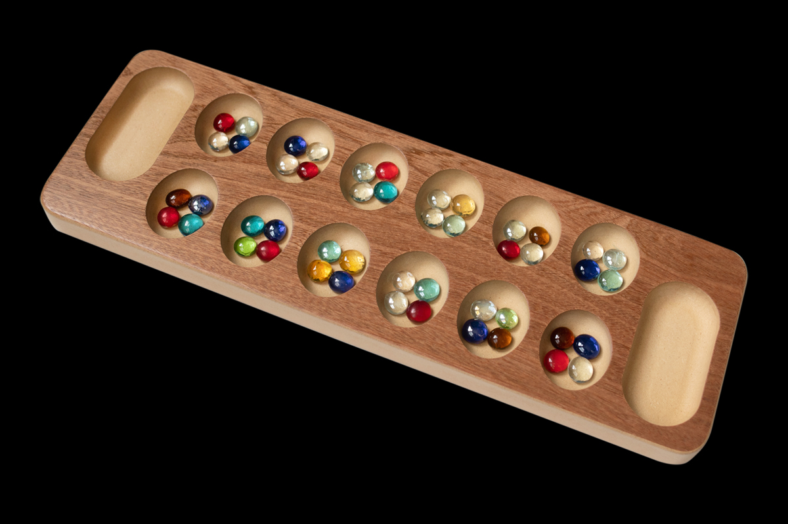

# Mancala


Toy command line Mancala board game implemented with python using a composition-ish based OOP approach.

👉[Live demo](https://replit.com/@KevinKuei/Mancala-Game#main.py)👈

## Rules
* Read about the official rules for the game [here](https://www.officialgamerules.org/mancala).
* Alternatively, tinker around/experiement in this fancier web implementation at this [link](https://www.mathplayground.com/mancala.html).

## Implementation Notes

### Classes
The game is implemented with four basic classes:
* Mancala - Mancala class representing the game as played.
* Player - Player class representing each of the players.
* Board - Board class representing the Mancala board.
* Container - Container class representing seed pits/stores.

### Design
The smallest abstraction is a `Container` class that is used to represent seed 'pits' and 'stores'. Containers can store seeds, and have attribute pointers to the next pits/store in line (similar to nodes in a tree). Containers can also have 'adjacent' attribute pointers (in the case that they are pits), to select opposing player pits. This is useful for implementing special game rules such as when a player lands on one of their empty pits with their last seed in a given turn.

Pits and stores are strung together through their pointers to create a closed-circuit, which emulates the counter-clockwise navigation and traversal of the physical Mancala board.

The `Board` class is subsequently represented as a collection of Container objects. Given any one of the pointers for a pit, the board can be traversed, and seeds distributed amongst them. The pointers for the pits/stores for each player are collected/grouped as an attribute in the Board class to create a common access interface. This makes manipulation of seed values, in conjunction with the pointers, trivial for tasks such as distributing and transfering seeds between other pits and stores.

Players are presented by a trivial `Player` class with their names.

The `Mancala` class representing the game as played, builds on the other class abstractions. Each Mancala object has two Players, and a Board.

They salient snippet of code for modelling the board (taken from the `setup_board` method of the `Board` class) is as follows:

```python
# Create player 1 store and pits.
p1_store = Container('store', 1, 'store')
p1_pits = [Container(i, 1, 'pit') for i in range(1, self.get_num_pits()+1)]

# Create player 2 store and pits.
p2_store = Container('store', 2, 'store')
p2_pits = [Container(i, 2, 'pit') for i in range(1, self.get_num_pits()+1)]

# Next, create a closed-circuit for the game board by connecting the containers.
# First, chain the pits together, consecutively, for player 1 and 2.
for i in range(0, self.get_num_pits() - 1):
	p1_pits[i].set_next(p1_pits[i + 1])
	p2_pits[i].set_next(p2_pits[i + 1])

# Next, chains the ends of the stores and pits for player 1 and 2.
p1_pits[-1].set_next(p1_store)
p1_store.set_next(p2_pits[0])
p2_pits[-1].set_next(p2_store)
p2_store.set_next(p1_pits[0])

# Set the adjacent nodes, which will be opposing, i.e.
#   p2: 6 5 4 3 2 1
#   p1: 1 2 3 4 5 6
for i in range(0, self.get_num_pits()):
	p1_pits[i].set_adjacent(p2_pits[self.get_num_pits()-1-i])
	p2_pits[i].set_adjacent(p1_pits[self.get_num_pits()-1-i])

# Initialize all the pits with the specified number of seeds.
[pit.set_seeds(self.get_num_seeds()) for pit in p1_pits + p2_pits]

# Create a common access interface for the containers. Represent the board
# with a nested dictionary, where the first level is player id (1 or 2), and
# the second is the pit/store id.
board = {1: {}, 2: {}}
for pit in p1_pits:
  board[1][pit.get_id()] = pit
for pit in p2_pits:
	board[2][pit.get_id()] = pit
board[1]['store'] = p1_store
board[2]['store'] = p2_store
self._board = board

```

## Example Gameplay
```

███╗   ███╗ █████╗ ███╗   ██╗ ██████╗ █████╗ ██╗      █████╗
████╗ ████║██╔══██╗████╗  ██║██╔════╝██╔══██╗██║     ██╔══██╗
██╔████╔██║███████║██╔██╗ ██║██║     ███████║██║     ███████║
██║╚██╔╝██║██╔══██║██║╚██╗██║██║     ██╔══██║██║     ██╔══██║
██║ ╚═╝ ██║██║  ██║██║ ╚████║╚██████╗██║  ██║███████╗██║  ██║
╚═╝     ╚═╝╚═╝  ╚═╝╚═╝  ╚═══╝ ╚═════╝╚═╝  ╚═╝╚══════╝╚═╝  ╚═╝
Seed your swords! A Portfolio Project.
By Kevin Kuei

Enter player 1 name: Kevin
Enter player 2 name: Alan

Initial board:
Player 2    6   5   4   3   2   1 
╔═════════╦═══╦═══╦═══╦═══╦═══╦═══╦═════════╗
║ Store 2 ║ 4 ║ 4 ║ 4 ║ 4 ║ 4 ║ 4 ║ Store 1 ║
║    0    ╠═══╬═══╬═══╬═══╬═══╬═══╣    0    ║
║         ║ 4 ║ 4 ║ 4 ║ 4 ║ 4 ║ 4 ║         ║
╚═════════╩═══╩═══╩═══╩═══╩═══╩═══╩═════════╝
Player 1    1   2   3   4   5   6 

Player 1 (Kevin) turn.
Choose a pit (1-6): 1

Player 2    6   5   4   3   2   1 
╔═════════╦═══╦═══╦═══╦═══╦═══╦═══╦═════════╗
║ Store 2 ║ 4 ║ 4 ║ 4 ║ 4 ║ 4 ║ 4 ║ Store 1 ║
║    0    ╠═══╬═══╬═══╬═══╬═══╬═══╣    0    ║
║         ║ 0 ║ 5 ║ 5 ║ 5 ║ 5 ║ 4 ║         ║
╚═════════╩═══╩═══╩═══╩═══╩═══╩═══╩═════════╝
Player 1    1   2   3   4   5   6 

Player 2 (Alan) turn.
Choose a pit (1-6): 2

Player 2    6   5   4   3   2   1 
╔═════════╦═══╦═══╦═══╦═══╦═══╦═══╦═════════╗
║ Store 2 ║ 5 ║ 5 ║ 5 ║ 5 ║ 0 ║ 4 ║ Store 1 ║
║    0    ╠═══╬═══╬═══╬═══╬═══╬═══╣    0    ║
║         ║ 0 ║ 5 ║ 5 ║ 5 ║ 5 ║ 4 ║         ║
╚═════════╩═══╩═══╩═══╩═══╩═══╩═══╩═════════╝
Player 1    1   2   3   4   5   6 

Player 1 (Kevin) turn.
Choose a pit (1-6): 3

Player 2    6   5   4   3   2   1 
╔═════════╦═══╦═══╦═══╦═══╦═══╦═══╦═════════╗
║ Store 2 ║ 5 ║ 5 ║ 5 ║ 5 ║ 0 ║ 5 ║ Store 1 ║
║    0    ╠═══╬═══╬═══╬═══╬═══╬═══╣    1    ║
║         ║ 0 ║ 5 ║ 0 ║ 6 ║ 6 ║ 5 ║         ║
╚═════════╩═══╩═══╩═══╩═══╩═══╩═══╩═════════╝
Player 1    1   2   3   4   5   6 

Player 2 (Alan) turn.
Choose a pit (1-6): 4

Player 2    6   5   4   3   2   1 
╔═════════╦═══╦═══╦═══╦═══╦═══╦═══╦═════════╗
║ Store 2 ║ 6 ║ 6 ║ 0 ║ 5 ║ 0 ║ 5 ║ Store 1 ║
║    1    ╠═══╬═══╬═══╬═══╬═══╬═══╣    1    ║
║         ║ 1 ║ 6 ║ 0 ║ 6 ║ 6 ║ 5 ║         ║
╚═════════╩═══╩═══╩═══╩═══╩═══╩═══╩═════════╝
Player 1    1   2   3   4   5   6 

Player 1 (Kevin) turn.
Choose a pit (1-6): 5

Player 2    6   5   4   3   2   1 
╔═════════╦═══╦═══╦═══╦═══╦═══╦═══╦═════════╗
║ Store 2 ║ 6 ║ 6 ║ 1 ║ 6 ║ 1 ║ 6 ║ Store 1 ║
║    1    ╠═══╬═══╬═══╬═══╬═══╬═══╣    2    ║
║         ║ 1 ║ 6 ║ 0 ║ 6 ║ 0 ║ 6 ║         ║
╚═════════╩═══╩═══╩═══╩═══╩═══╩═══╩═════════╝
Player 1    1   2   3   4   5   6 

Player 2 (Alan) turn.
Choose a pit (1-6): 6

Player 2    6   5   4   3   2   1 
╔═════════╦═══╦═══╦═══╦═══╦═══╦═══╦═════════╗
║ Store 2 ║ 0 ║ 6 ║ 1 ║ 6 ║ 1 ║ 6 ║ Store 1 ║
║    2    ╠═══╬═══╬═══╬═══╬═══╬═══╣    2    ║
║         ║ 2 ║ 7 ║ 1 ║ 7 ║ 1 ║ 6 ║         ║
╚═════════╩═══╩═══╩═══╩═══╩═══╩═══╩═════════╝
Player 1    1   2   3   4   5   6 

Player 1 (Kevin) turn.
Choose a pit (1-6): 7
Value must be an integer between 1-6!
Choose a pit (1-6): 6

Player 2    6   5   4   3   2   1 
╔═════════╦═══╦═══╦═══╦═══╦═══╦═══╦═════════╗
║ Store 2 ║ 0 ║ 7 ║ 2 ║ 7 ║ 2 ║ 7 ║ Store 1 ║
║    2    ╠═══╬═══╬═══╬═══╬═══╬═══╣    3    ║
║         ║ 2 ║ 7 ║ 1 ║ 7 ║ 1 ║ 0 ║         ║
╚═════════╩═══╩═══╩═══╩═══╩═══╩═══╩═════════╝
Player 1    1   2   3   4   5   6 

Player 2 (Alan) turn.
Choose a pit (1-6): 5

Player 2    6   5   4   3   2   1 
╔═════════╦═══╦═══╦═══╦═══╦═══╦═══╦═════════╗
║ Store 2 ║ 1 ║ 0 ║ 2 ║ 7 ║ 2 ║ 7 ║ Store 1 ║
║    3    ╠═══╬═══╬═══╬═══╬═══╬═══╣    3    ║
║         ║ 3 ║ 8 ║ 2 ║ 8 ║ 2 ║ 0 ║         ║
╚═════════╩═══╩═══╩═══╩═══╩═══╩═══╩═════════╝
Player 1    1   2   3   4   5   6 

Player 1 (Kevin) turn.
Choose a pit (1-6): 4

Player 2    6   5   4   3   2   1 
╔═════════╦═══╦═══╦═══╦═══╦═══╦═══╦═════════╗
║ Store 2 ║ 1 ║ 1 ║ 3 ║ 8 ║ 3 ║ 8 ║ Store 1 ║
║    3    ╠═══╬═══╬═══╬═══╬═══╬═══╣    4    ║
║         ║ 3 ║ 8 ║ 2 ║ 0 ║ 3 ║ 1 ║         ║
╚═════════╩═══╩═══╩═══╩═══╩═══╩═══╩═════════╝
Player 1    1   2   3   4   5   6 

Player 2 (Alan) turn.
Choose a pit (1-6): 3

Player 2    6   5   4   3   2   1 
╔═════════╦═══╦═══╦═══╦═══╦═══╦═══╦═════════╗
║ Store 2 ║ 2 ║ 2 ║ 4 ║ 0 ║ 3 ║ 8 ║ Store 1 ║
║    4    ╠═══╬═══╬═══╬═══╬═══╬═══╣    4    ║
║         ║ 4 ║ 9 ║ 3 ║ 1 ║ 3 ║ 1 ║         ║
╚═════════╩═══╩═══╩═══╩═══╩═══╩═══╩═════════╝
Player 1    1   2   3   4   5   6 

Player 1 (Kevin) turn.
Choose a pit (1-6): 2

Player 2    6   5   4   3   2   1 
╔═════════╦═══╦═══╦═══╦═══╦═══╦═══╦═════════╗
║ Store 2 ║ 2 ║ 2 ║ 5 ║ 1 ║ 4 ║ 9 ║ Store 1 ║
║    4    ╠═══╬═══╬═══╬═══╬═══╬═══╣    5    ║
║         ║ 4 ║ 0 ║ 4 ║ 2 ║ 4 ║ 2 ║         ║
╚═════════╩═══╩═══╩═══╩═══╩═══╩═══╩═════════╝
Player 1    1   2   3   4   5   6 

Player 2 (Alan) turn.
Choose a pit (1-6): 1

Player 2    6   5   4   3   2   1 
╔═════════╦═══╦═══╦═══╦═══╦═══╦═══╦═════════╗
║ Store 2 ║ 3 ║ 3 ║ 6 ║ 2 ║ 5 ║ 0 ║ Store 1 ║
║    5    ╠═══╬═══╬═══╬═══╬═══╬═══╣    5    ║
║         ║ 5 ║ 1 ║ 5 ║ 2 ║ 4 ║ 2 ║         ║
╚═════════╩═══╩═══╩═══╩═══╩═══╩═══╩═════════╝
Player 1    1   2   3   4   5   6 

Player 1 (Kevin) turn.
```
